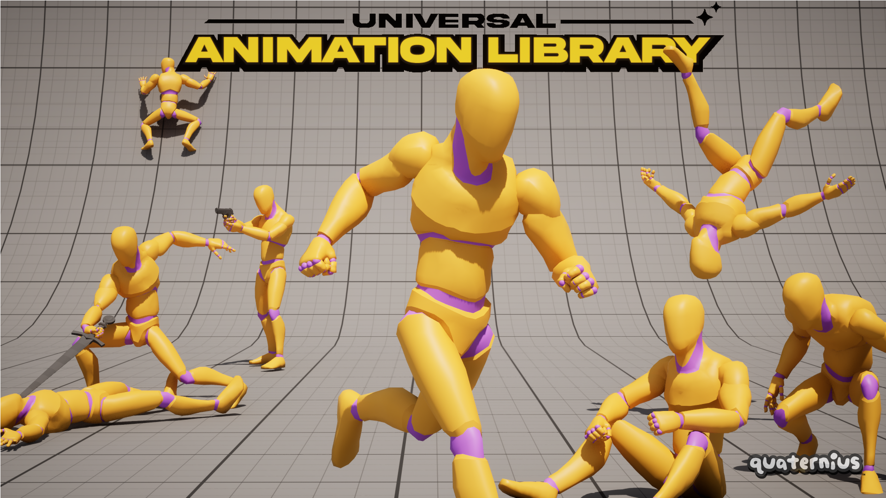

# gltf-universal-animation-library
This is the standard FREE version of @Quaternius's Universal Animation Library as distributed at [itch.io](https://quaternius.itch.io/universal-animation-library) on 2025-06-10 (with gltf files only to keep the repository as small as possible) 

It only contains a portion of the animations. You can buy the PRO version which has all the animations, or the SOURCE version which has all the animations and also includes .blend files.

You can get the other versions from the author's website https://quaternius.com

# Licence :
This pack is licensed under CC0 1.0. Full details in [LICENSE](https://github.com/J-Ponzo/gltf-medieval-village-megakit/blob/main/LICENSE)

# Author :
I'm not the author of the asset. It was created by @Quaternius.

You can support him on Patreon : https://www.patreon.com/quaternius
And join his discord Server : https://discord.gg/vJqnRUYRfT

All this information was in the archive downloaded from itch.io and I thought it appropriate to provide it here.
